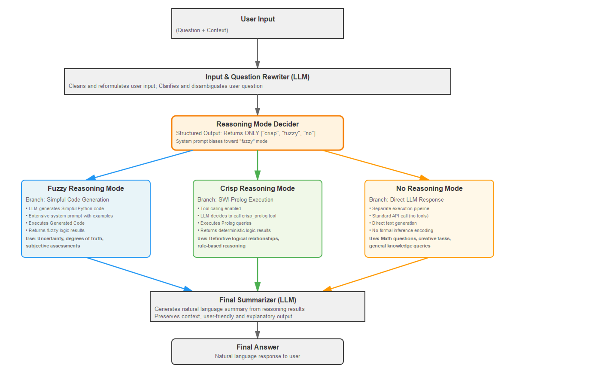

# Hybrid Reasoning System: Fuzzy, Crisp, and No-Reasoning Modes

A  reasoning system that  selects between three different inference modes (fuzzy logic, crisp logic via SWI-Prolog, and direct LLM reasoning) based on the nature of the query. Inspired by [Logic-LLM](https://github.com/teacherpeterpan/Logic-LLM). 
I would like to give special thanks to [Marco S. Nobile](https://github.com/aresio) for sharing a brief but valuable insight about the Simpful library via email, as well as for his responsive communication. For Fuzzy Inference, Simpful library was used, [Simpful Library](https://github.com/aresio/simpful)

## Architecture Overview




## Prerequisites

### 1. Install SWI-Prolog

This project requires SWI-Prolog to be installed on your system for crisp logic reasoning.

**Installation:** [Download and install SWI-Prolog](https://www.swi-prolog.org/download/stable)

Verify installation by running:
```bash
swipl --version
```

### 2. Python Environment Setup

Create a virtual environment and install dependencies:

```bash
# Create virtual environment
python -m venv venv
```
Activate virtual environment
```bash
# On Windows:
venv\Scripts\activate
```
For macOS/Linux systems:
```bash
# On macOS/Linux:
source venv/bin/activate
```
Then install dependencies:
```bash
# Install dependencies
pip install -r requirements.txt
```
### 3. OpenAI API setup

This project uses the OpenAI API. You must set your OpenAI API key as an environment variable named **`OPENAI_API_KEY`** before running the program.

#### Windows (Command Prompt)
```bat
setx OPENAI_API_KEY your_api_key_here
```
#### Linux
```bat
export OPENAI_API_KEY="your_api_key_here"
```


## Running the Program

Simply execute the main logic file from **src** directory (Make Sure virtual environment where
you installed the dependencies is activated.):

```bash
cd src
python main_logic.py
```

## Architecture Overview

The system implements a three-mode decision framework that intelligently routes queries to the most appropriate reasoning engine.

### 1. Input Processing & Rewriting

Before reasoning mode selection, the system performs two key preprocessing steps:

- **Input Rewriting:** User input is cleaned and reformulated into a clearer, more structured format
- **Question Rewriting:** The user's question is clarified and disambiguated by the LLM rewriter component

This ensures that the reasoning mode decision is based on well-formed, unambiguous input.

### 2. Reasoning Mode Selection

The `reasoning_decider` component analyzes the rewritten input and question to select one of three reasoning modes:

#### **Fuzzy Reasoning Mode**
- Primary focus of the system (system prompt biases toward this mode)
- LLM generates Simpful-based Python code for fuzzy inference
- Generated code is executed to produce fuzzy logic results
- Ideal for: uncertainty, degrees of truth, approximate reasoning, subjective assessments

#### **Crisp Reasoning Mode**
- Utilizes SWI-Prolog for classical logical inference
- LLM decides whether to invoke the `crisp_prolog` tool via tool calling
- Executes Prolog queries and returns deterministic logical results
- Ideal for: definitive logical relationships, rule-based reasoning, precise deductions
- Examples available in the `examples/` directory

#### **No Reasoning Mode**
- Direct LLM response without formal inference engines
- Used when logical encoding would be impractical or unnecessary
- **Specifically chosen for mathematical questions** to avoid requiring the LLM to encode mathematical facts into programs (which would bloat the system)
- Separate execution branch without tool calling
- Ideal for: creative tasks, open-ended questions, mathematical computations, general knowledge queries

### 3. Structured Output for Mode Decision

The reasoning mode selection uses **structured output** to ensure deterministic decision-making:

- LLM returns **only one of three strings**: `crisp`, `fuzzy`, or `no`
- This constraint prevents hallucination and ensures valid mode selection
- No free-form text generation during this critical decision point

### 4. Mode-Specific Execution Paths

The system employs **separate execution branches** for each mode to minimize hallucination:

#### Why Separation Was Necessary

Initial attempts to integrate both crisp and fuzzy reasoning into a unified tool-calling framework resulted in frequent hallucinations. The solution was to separate the execution paths:

**No Reasoning Branch:**
- Completely separate pipeline
- Simple LLM API call without tools
- Direct textual summary generation
- No structured constraints beyond basic prompting

**Fuzzy Reasoning Branch:**
- Explicit instruction to generate Simpful Python code
- Extensive system prompt with Simpful code examples
- Code generation → Execution → Result capture
- Isolated from crisp logic to prevent mode confusion

**Crisp Reasoning Branch:**
- Retains tool calling capability
- Dedicated `crisp_logic` system prompt
- LLM autonomously decides whether to invoke `crisp_prolog` tool
- Tool executes SWI-Prolog program based on the query
- Results returned to LLM for interpretation

### 5. Final Summarization

After the reasoning mode completes its inference:

- Results are passed to a final LLM call
- Summary is generated in natural language
- Context from the original question is preserved
- Output is user-friendly and explanatory

## OpenAI API Features Utilized

This project demonstrates usage of the OpenAI API:

1. **Tool Calling**: Used in crisp reasoning mode to invoke the Prolog runner
2. **Structured Output**: Enforces exact format for reasoning mode selection (`crisp`, `fuzzy`, `no`)
3. **Standard API Calls**: Used in no-reasoning mode for straightforward text generation
4. **System Prompting (Role-Based Prompts)**: Separate, tailored system prompts for each reasoning mode
5. **Temperature Parameter**: Reduced from default value of 1.0 to achieve more deterministic reasoning and reduce hallucination on logical problem domains

### Temperature Tuning

Lower temperature values are used throughout the system to:
- Increase determinism in logical reasoning
- Reduce creative hallucination
- Improve consistency in code generation
- Ensure reliable mode selection

## Examples

See the `examples/` directory for sample queries demonstrating (each example is presented with 
corresponding raw_context input and raw_question input):
- Fuzzy reasoning scenarios
- Crisp logic applications
- Cases where no formal reasoning is preferred (e.g., arithmetical questions)

## LLM Judge

To evaluate the system's performance on a test dataset using LLM as a judge:
```bash
cd src
python evaluate.py ../evaluation/problems.json
```

This will:
- Process each test case through the fuzzy reasoning pipeline
- Compare generated answers against predefined expected answers using an LLM judge
- Output evaluation scores (1 for pass, 0 for fail) as structured output
- Generate a results JSON file and visualization PNG showing success vs failure rates

### Test Case Format

The JSON file should contain an array of test cases:
```json
[
  {
    "id": "test_1",
    "raw_context": "Context text...",
    "raw_question": "Question text...",
    "answer": "Expected answer..."
  }
]
```
### Judge Architecture


## Project Structure

```
.
├── src/         # Python Source code 
├── requirements.txt       # Python dependencies
├── examples/             # Example queries and outputs
├── evaluation/ # problems json dataset, also evaluate.py stores the results here. 

```


---

**Note:** This system demonstrates a hybrid approach to AI reasoning, combining symbolic logic (Prolog), fuzzy inference (Simpful), and standard LLM (OpenAI) in a unified framework. If you encounter any issues, please feel free to raise an issue directly.